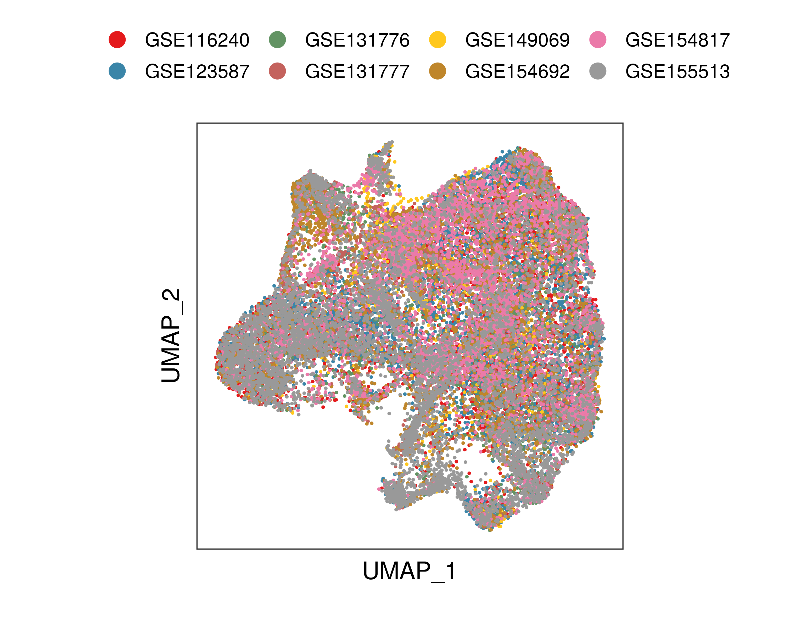
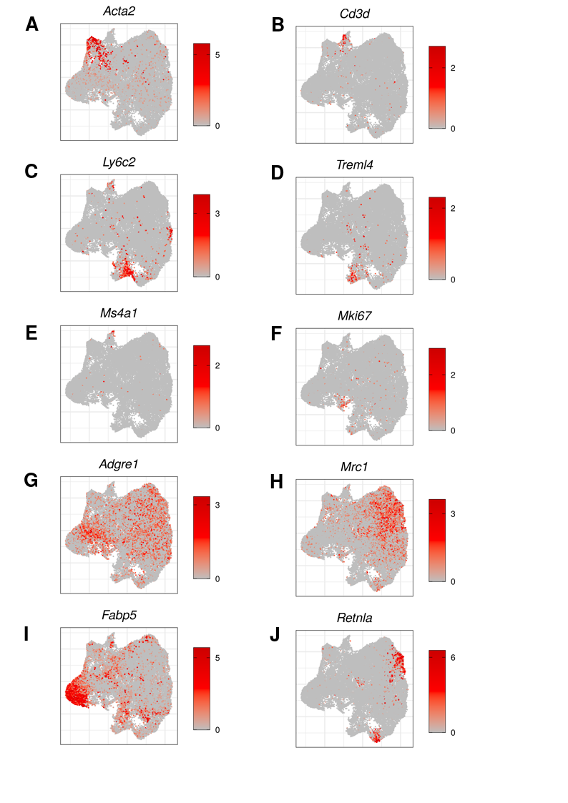
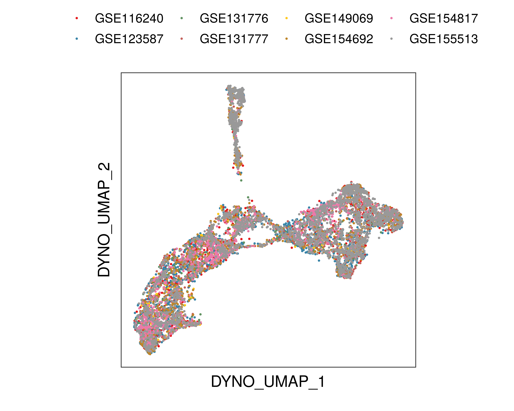
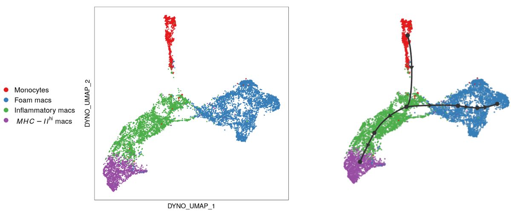
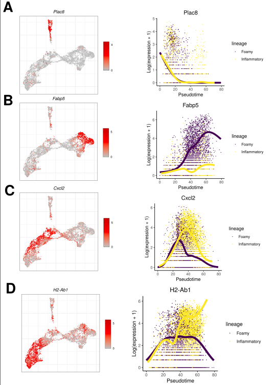
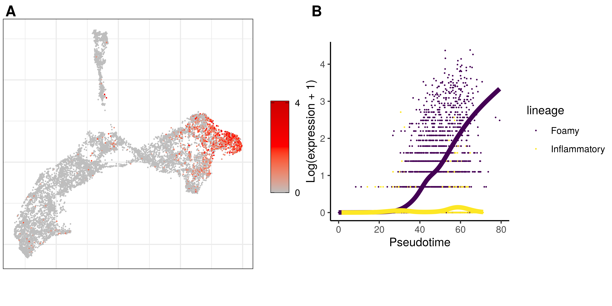
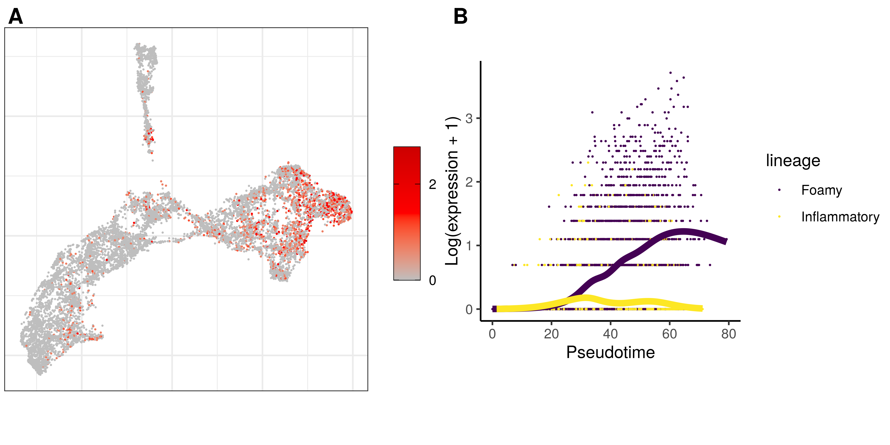

# sc_athero_itmo_master
The repository contains code related to the master project
(ITMO University, Bioinformatics and Systems Biology program).

Student: Maria Firulyova
Advisor: Konstantin Zaitsev
Consltant: Jesse W. Williams

Defence presentation: [link](https://drive.google.com/file/d/1ikXU218StCGpH3tyRRBr6-eyoYHOJe7E/view?usp=sharing)

# Project goal

Trajectory analysis of intimal myeloid cells using public available scRNA-seq datasets

All datasets were uploaded into [scNavigator](https://artyomovlab.wustl.edu/scn/) for
interactive results exploration (see aims)

# Project aims

1) Metadataset creation
    
    **SCN**: [link](https://artyomovlab.wustl.edu/scn/?token=ath_target_gu4AeYil)

2) Preparation of metadataset with only myeloid cells

    **SCN**: [link](https://artyomovlab.wustl.edu/scn/?token=ath_traj_reanalyzed_eefai2oK)

3) Downstream analysis of prepared metadataset with only myeloid cells
    
    **SCN**: [link](https://artyomovlab.wustl.edu/scn/?token=ath_traj_reanalyzed_eefai2oK)
    
    **shiny-app**: [link](https://mmfirulyova.shinyapps.io/summary/)

# Repository structure

## 1) raw_data_processing

This folder contains all scripts related to Seurat objects preparation
for both sample-level (*SRS* pattern) and study-level (*merged*) pattern.

*Snakefile* in each sub-folder corresponds to the whole pipeline

The *rules* directory contains all rules which were implemented during the pipeline

The *scripts* directory contains all required scripts (e.g., seurat-analysis, definition of 10x version,
preparation of kallisto script, etc)

**Figure 1**: metadataset, cells are colored by study id

**Figure 2**: metadataset, cells are colored by marker genes expression

## 2) ti_analysis

All objects from the *merged* folders were integrated into whole metadataset. 
Then, myeloid cells were found using canonical gene markers, and target cells were combined
into myeloid metadataset

*Snakefile* contains all required rules for myeloid metadataset preparation

*config.yaml* -- yaml file for conda env installation 

The *rules* directory contains all rules which were implemented during the pipeline

The *scripts* directory contains all required scripts (cells extraction & reanalysis using Seurat)

## 3) ti_analysis

This repository contains scripts related to:
* trajectory analysis (slingshot, dyno): *rules/ti_inference* rule
* diff expression analysis across pseudotime (TradeSeq): *rules/trade_seq* rule

**Figure 3**: myeloid metadataset with 4 cell types (monocytes, foam macrophages,
inflammatory macrophages, *MHC-II* macrophages) with builded trajectory topology

**Figure 4**: feature plot & TradeSeq plots for gene markers; A -- monocytes,
B -- foam macrophages, C -- inflammatory macrophages, D -- *MHC-II* macrophages

**Figure 5**: A -- *Atp6v0d2* expression in myeloid metadataset, B -- *Atp6v0d2* expression across pseudotime

**Figure 6**: A -- *Il7r* expression in myeloid metadataset, B -- *Il7r* expression across pseudotime

# Main results

* Appropriate scRNA-seq studies were found, processed and annotated
* Only myeloid cells were extracted from prepared meta-dataset for downstream analysis
* Trajectory analysis was run on myeloid cells, and two clear lineages were identified
* Both genes & regulons associated with pseudotime were found
* Two genes will be validated in the wet-lab
* All results can be explored interactively using SCN

# Contancts

email: mmfiruleva{at}gmail.com

telegram: @mfiruleva